# Heart Disease Classification: A Case Study

## 📌 Overview
This project presents an in-depth case study on classifying heart disease using the **UCI Heart Disease Dataset**. Multiple machine learning models are explored, fine-tuned, and evaluated to determine the most effective classifier.

The study follows a structured workflow:
- **Understanding the Dataset** 📊
- **Training Multiple Classification Models** 🤖
- **Hyperparameter Tuning** 🎛️
- **Evaluating Model Performance** 📈
- **Feature Importance Analysis** 🔍

## 📂 Dataset: UCI Heart Disease
The dataset contains various clinical and demographic attributes that influence heart disease prediction. Each feature is analyzed to understand its correlation with the target variable (presence or absence of heart disease).

### Key Features:
- **Age**
- **Sex**
- **Chest Pain Type**
- **Resting Blood Pressure**
- **Cholesterol Levels**
- **Fasting Blood Sugar**
- **Resting ECG Results**
- **Maximum Heart Rate Achieved**
- **Exercise-Induced Angina**
- **ST Depression Induced by Exercise**
- **Number of Major Vessels Colored by Fluoroscopy**
- **Thalassemia Type**

### 🔹 Data Exploration
- **Feature Distributions** and missing values are analyzed.
- **Correlation Heatmap** shows relationships between independent variables and the target.

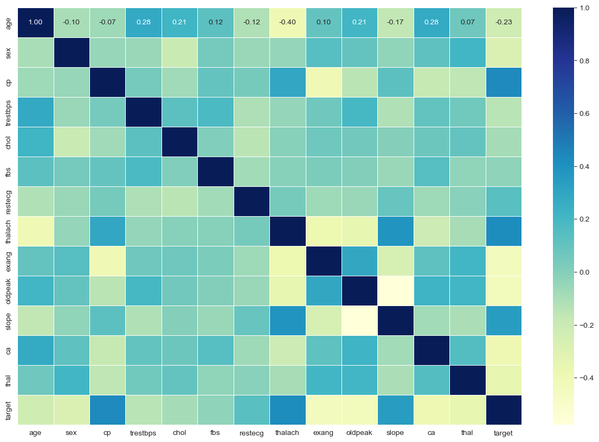

#### **Disease Frequency by Sex**
- Examines how heart disease prevalence differs between males and females.

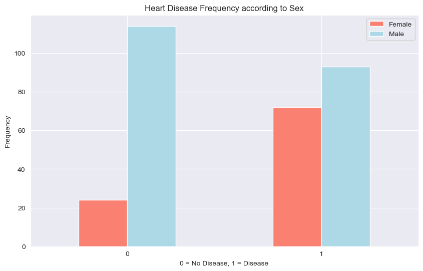

#### **Chest Pain Types and Disease Presence**
- Identifies which chest pain types are most associated with heart disease.

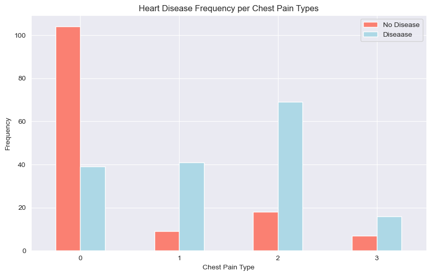

#### **Age vs Maximum Heart Rate**
- Scatter plot to analyze the relationship between age and max heart rate.

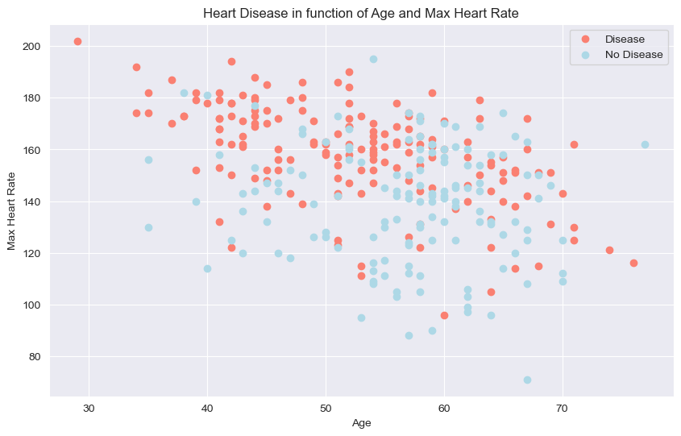

- Histogram to better visualize the overall distribution of heart rate by age group.

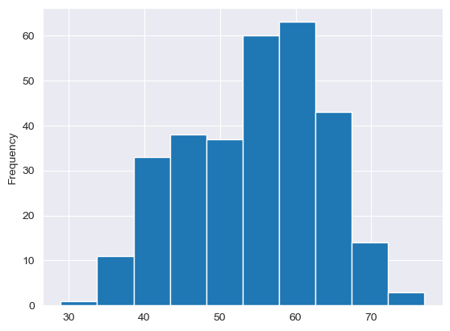

## ⚡ Machine Learning Models
We train multiple classification models and compare their performances:
- **Logistic Regression**
- **K-Nearest Neighbors (KNN)**
- **Random Forest**
- **Support Vector Machine (SVM)**
- **Decision Tree**
- **Naïve Bayes**
- **Gradient Boosting**

Each model is trained on the dataset, and their accuracy scores are compared.

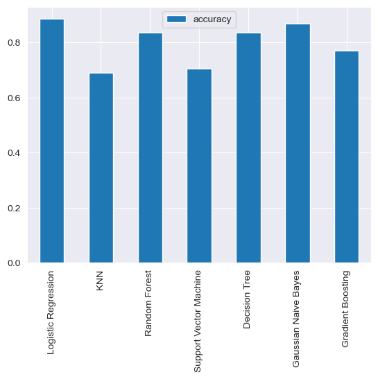

## 🔧 Hyperparameter Tuning
- **Manual tuning** for a selected model.
- **Random Search & Grid Search** to optimize parameters for all models.

After tuning, models are retrained using the best hyperparameters.

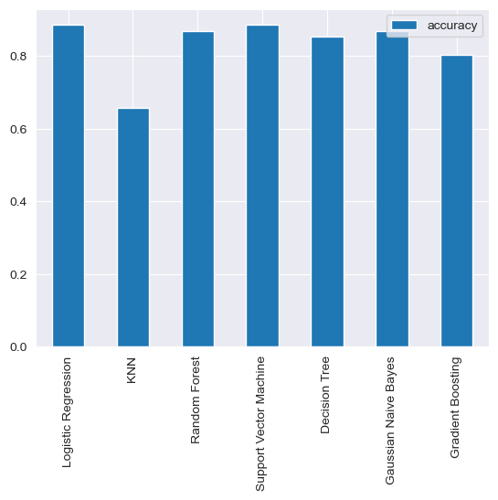

## 📊 Model Evaluation Metrics
Once optimized, the best-performing models are evaluated using:

### 📌 ROC Curve & AUC Score
- **ROC Curve** (Receiver Operating Characteristic) visualizes the trade-off between sensitivity and specificity.
- **AUC Score** (Area Under Curve) measures classification ability.

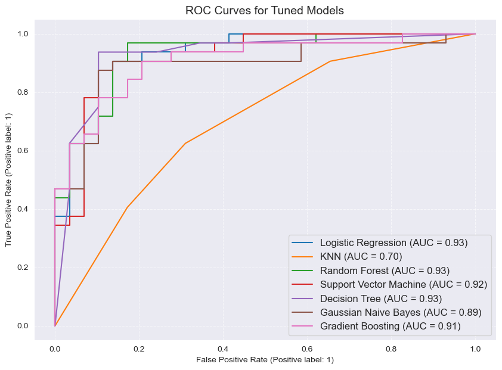

### 📌 Confusion Matrix
- Displays **True Positives, False Positives, False Negatives, and True Negatives**.
- Helps in analyzing classification errors.

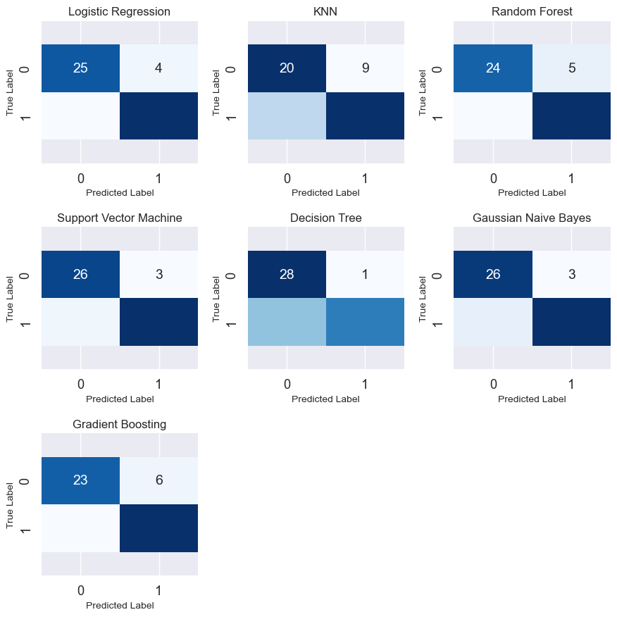

### 📌 Classification Report
Includes essential metrics:
- **Precision**: How many predicted positives are actually positive?
- **Recall**: How many actual positives are correctly identified?
- **F1-Score**: A balance between precision and recall.
- **Accuracy**: Overall correctness of the model.

### 📌 Cross-Validation Metrics
We perform **5-Fold Cross-Validation** to assess the model’s generalizability across different splits of data.

#### **Metrics Compared Across Models**
- **Cross-Validated Accuracy**
- **Precision**
- **Recall**
- **F1-Score**

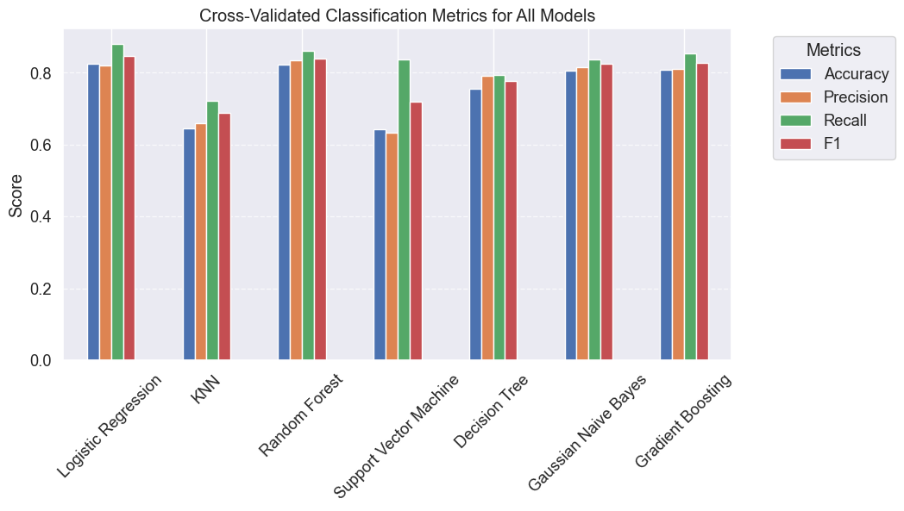

## 🔍 Feature Importance Analysis
- Determines which features contribute the most to model predictions.
- Analyzed for models with interpretable feature importance (e.g., Logistic Regression, Decision Tree, Random Forest, Gradient Boosting).

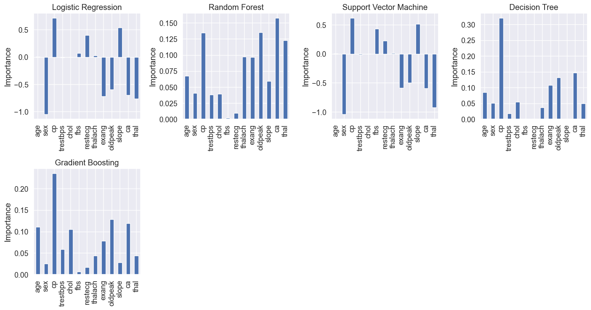

## ✅ Conclusion
This case study demonstrates a structured approach to classifying heart disease, leveraging multiple machine learning models, hyperparameter tuning, and performance evaluation techniques.

### **Key Takeaways:**
 - ✔️ **Data Exploration is crucial** before model training.
 - ✔️ **Hyperparameter tuning improves performance** significantly.
 - ✔️ **Model selection depends on multiple factors**, not just accuracy.
 - ✔️ **Feature importance analysis helps in understanding the model’s decision-making**.

---

## 🚀 Future Work
 - 🔹 Explore **Deep Learning Models** for improved accuracy.
 - 🔹 Implement **Explainable AI (XAI)** techniques to enhance interpretability.
 - 🔹 Deploy the model as a **Web Application for real-world use**.

---

## 🔗 Resources & References
- **UCI Heart Disease Dataset:** [Link to dataset](https://archive.ics.uci.edu/ml/datasets/heart+disease)
- **Machine Learning Techniques:** [Scikit-Learn Documentation](https://scikit-learn.org/stable/)

---

## 📝 License
This project is licensed under the **MIT License** - see the [LICENSE](LICENSE) file for details.

---

### 💡 Interested in this project? Feel free to contribute and expand upon these findings!

